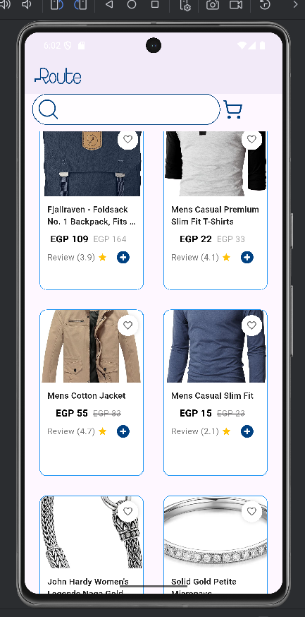

# FLUTTER CATALOG TASK:

## Screenshots

| Product List UI                              |
|----------------------------------------------|
|  |
                                                   Product Screen                                                   
:-----------------------------------------------------------------------------------------------------------------: |

## Directory Structure

     
 Click to expand 

project/
├── lib/
│   ├── core/
│   │   ├── errors/
│   │   ├── utils/
│   │   ├── service_locator/
│   │   │   └── service_locator.dart
│   │   ├── api_constance.dart
│   │   ├── app_assets.dart
│   │   └── app_color.dart
│   └── features/
│       └── products/
│           ├── data/
│           │   ├── models/
│           │   ├── repos/
│           │   │   ├── product_repo.dart
│           │   │   └── product_repo_impl.dart
│           │   └── services/
│           │       └── api_service.dart
│           └── ui/
│               ├── manager/
│               │   ├── product_cubit/
│               │   │   ├── products_cubit.dart
│               │   │   └── products_state.dart
│               ├── view/
│               └── widgets/
│               │    ├── custom_error_widget.dart
│               │   ├── loading_widget.dart
│               │    ├── product_list_view.dart
│               └── products_widget.dart    
└──  main.dart

- [Lab: Write your first Flutter app](https://docs.flutter.dev/get-started/codelab)
- [Cookbook: Useful Flutter samples](https://docs.flutter.dev/cookbook)

For help getting started with Flutter development, view the
[online documentation](https://docs.flutter.dev/), which offers tutorials,
samples, guidance on mobile development, and a full API reference.
